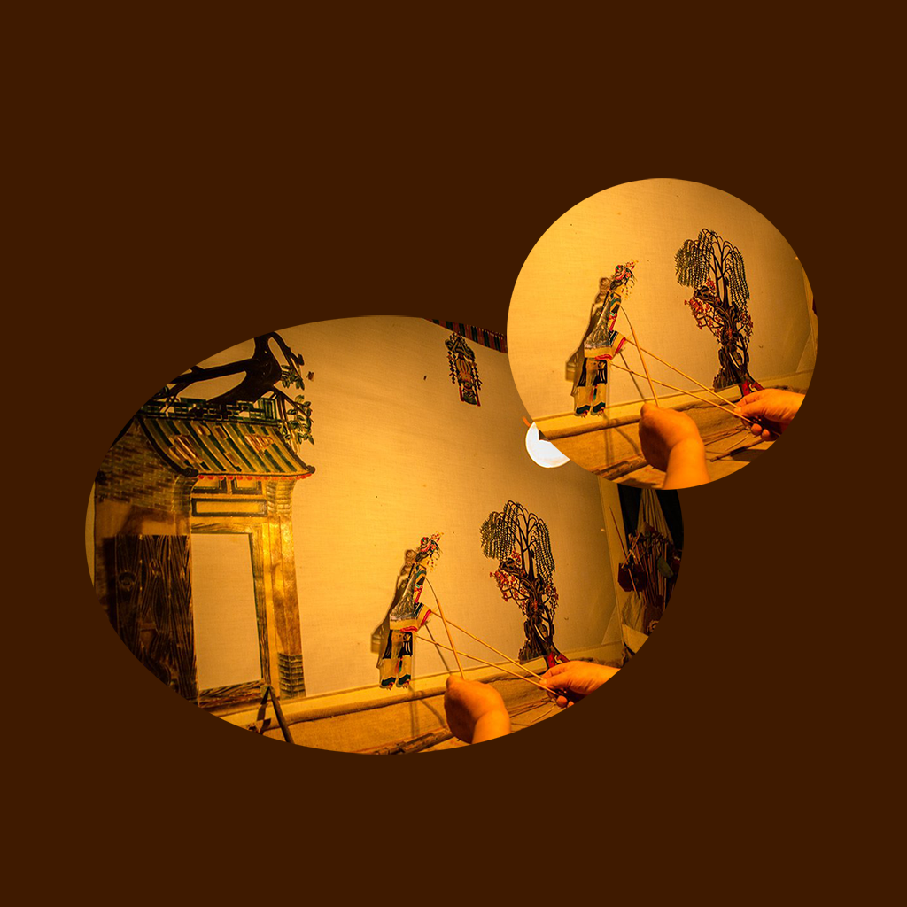

## 欢迎来到 我的皮影戏手工表演练习

皮影戏是一种以纸板做成的人物剪影以表演故事的民间艺术，表演皮影戏的人需要经过多番练习，同时配以打击乐器和弦乐才可以达到皮影戏艺术表演的效果。
这款应用可以帮助喜欢皮影戏表演的人记录平时的练习安排，以及手工表演道具准备和注意事项。帮助我们更好的安排如何合理的分配练习时间，并将日程安排和心得体会与团队成员分享。

如果您遇到什么需要解答的问题，请发送您的问题到以下邮箱。

我们将第一时间为您解答。

### 邮箱地址: zhanghesongyuan7@126.com

谢谢！
